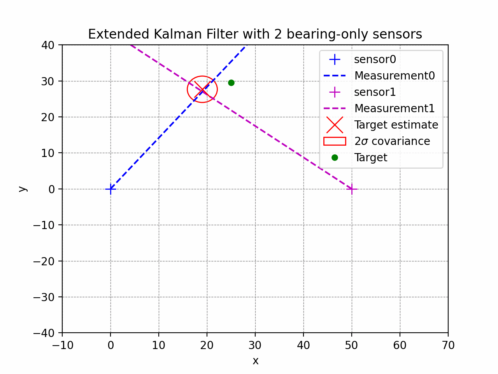
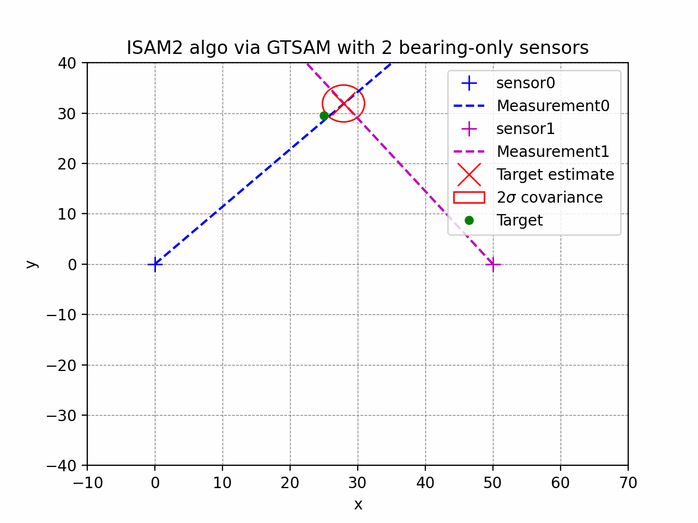
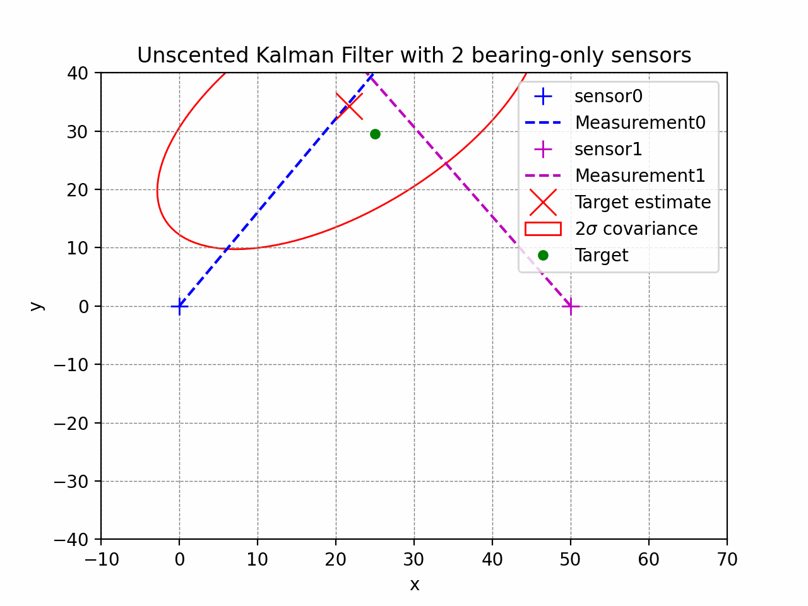

This repository provides ability to run target tracking simulations using various algorithms including Extended Kalman Filter, Unscented Kalman Filters, and incremental smoothing and mapping (ISAM2). ISAM2 is implemented via the gtsam C++ library. Below are demos using different algorithms tracking a single target using two noisy bearing-only sensors.

 

 
